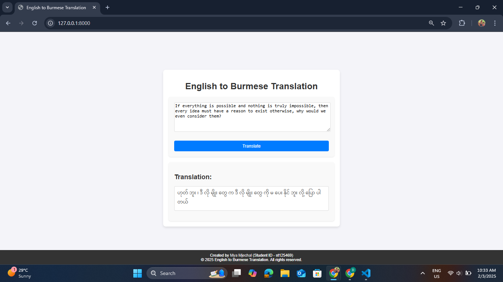

# A3: Make Your Own Machine Translation Language  
**AT82.05 Artificial Intelligence: Natural Language Understanding (NLU)**  
**_Instructor: Professor Chaklam Silpasuwanchai, Todsavad Tangtortan_**

## Table of Contents
- [Student Information](#student-information)
- [System Overview](#system-overview)
    - [Workflow](#workflow)
    - [Implementation](#implementation)
- [Tasks](#tasks)  
    - [Task 1: Dataset Acquisition & Preprocessing](#task-1-dataset-acquisition--preprocessing)  
    - [Task 2: Attention Mechanisms Implementation](#task-2-attention-mechanisms-implementation)  
    - [Task 3: Model Evaluation](#task-3-model-evaluation)  
    - [Task 4: Web Application for Machine Translation](#task-4-web-application-for-machine-translation)  
- [Installation Setup](#installation-setup)  
- [Usage](#usage)  
- [Demo and Screenshots](#demo-and-screenshots)  
- [References](#references)  

## Student Information  
- **Name:** Mya Mjechal  
- **Student ID:** st125469  
- **Major:** AIT - Data Science and Artificial Intelligence (DSAI)  
- **Course:** AT82.05: Artificial Intelligence: Natural Language Understanding  
- **Assignment:** NLP A3  

##  System Overview  
This project is based on **neural machine translation (NMT)** with attention mechanisms, as outlined in [`A3_Make_Your_Own_Machine_Translation_Language.pdf`](./A3_Make_Your_Own_Machine_Translation_Language.pdf). The system is designed to **translate sentences** between **English** and **Burmese** using an encoder-decoder architecture with three different attention mechanisms.

### Workflow  
1. **Input:** A sentence in English.  
2. **Processing:** The trained sequence-to-sequence model translates the sentence.
3. **Output:** The translated text is displayed in the target language (Burmese).

### Implementation  
- **Backend:** Flask is used for handling model execution and user requests.
- **Frontend:** A simple, responsive interface built using HTML, CSS, and JavaScript.
- **Models:** Sequence-to-sequence model with General, Multiplicative, and Additive Attention.  

## Tasks  

### Task 1: Dataset Acquisition & Preprocessing

1. **Dataset Selection:**

    The dataset was sourced from **Myanmar-XNLI**, a multilingual Natural Language Inference (NLI) dataset that includes parallel texts for English and Burmese. This dataset provides high-quality sentence pairs, making it suitable for machine translation and language modeling tasks.  

    - **Title:** Myanmar-XNLI  
    - **Creator:** Akhtet  
    - **Source:** [`Hugging Face - Myanmar-XNLI`](https://huggingface.co/datasets/akhtet/myanmar-xnli)  
    - **License:** Creative Commons Attribution Non Commercial 2.0 (CC BY-NC 2.0). More details available [`here`](https://creativecommons.org/licenses/by-nc/4.0/).  

2. **Preprocessing Steps**
    - **Data Preprocessing**

        For this project, a subset of the Myanmar-XNLI dataset was extracted and preprocessed to focus on English-Burmese translation. The dataset was filtered and reformatted to retain only relevant parallel text fields:  

        - **en (English):** Extracted from `sentence1_en`
        - **my (Myanmar):** Extracted from `sentence1_my`

        The processed dataset is available at: [`Hugging Face - Modified Dataset`](https://huggingface.co/datasets/myamjechal/en_my_myanmar-xnli_small).

    - **Tokenization**

        Pyidaungsu tokenizer is used for Burmese texts. It is a Python library that supports word-level tokenization, helping to segment Myanmar sentences into meaningful units.  

        More details: [`Pyidaungsu`](https://pypi.org/project/pyidaungsu/)


### Task 2: Attention Mechanisms Implementation  

The model is built using a **Seq2Seq architecture** with three attention types:

| Attention Type          | Equation |
|-------------------------|----------|
| **General Attention**  | \( e_i = s^T h_i \) |
| **Multiplicative Attention**  | \( e_i = s^T W h_i \) |
| **Additive Attention**  | \( e_i = v^T \tanh(W_1 h_i + W_2 s) \) |


### Task 3: Model Evaluation  

#### Performance Metrics:  
- **Perplexity (PPL)**  
- **Training & Validation Loss**  
- **Attention Visualization**

#### Performance Table  
| Attention Mechanism |  Training Loss | Validation Loss | Training PPL | Validation PPL |
|--------------------|--------------|---------------|--------------|--------------|
| General Attention | 3.181 | 4.275 | 24.068 | 71.896 |
| Multiplicative Attention |  3.187 | 4.295 | 24.220 | 73.365 |
| Additive Attention | 3.116 | 4.276 | 22.553 | 71.936 |

#### Performance Plots


_Figure 1: General Attention Train Loss Plot_


_Figure 2: Multiplicative Attention Train Loss Plot_


_Figure 3: Additive Attention Train Loss Plot_

#### Attention Maps


_Figure 4: General Attention Map_


_Figure 5: Multiplicative Attention Map_


_Figure 6: Additive Attention Map_

#### Analysis and Discussion

The results indicate that the **Additive Attention** mechanism performed the best among the three attention types evaluated. This conclusion is based on the lower training and validation loss, as well as the lower perplexity (PPL) values observed during the model evaluation phase.

#### Effectiveness of Additive Attention:
- **Training Loss:** The Additive Attention mechanism achieved the lowest training loss (3.116), indicating that the model was able to learn the training data more effectively compared to General and Multiplicative Attention.
- **Validation Loss:** Similarly, the validation loss for Additive Attention (4.276) was the lowest, suggesting better generalization to unseen data.
- **Perplexity (PPL):** The perplexity values for both training (22.553) and validation (71.936) were the lowest for Additive Attention, further confirming its effectiveness in handling the translation task.

#### Translation Quality:
The lower perplexity and loss values imply that the Additive Attention mechanism can better capture the nuances of the translation between English and Burmese. This is particularly important given the structural and syntactic differences between the two languages. The attention mechanism helps the model focus on relevant parts of the input sentence, improving the accuracy and fluency of the translated output.

#### Visualizations:
The attention maps for Additive Attention also show more focused and coherent alignments between the source and target sentences, which is crucial for producing high-quality translations.

In summary, the Additive Attention mechanism has proven to be the most effective for this machine translation task, providing better performance metrics and more accurate translations between English and Burmese.


### Task 4: Web Application for Machine Translation  

A web application was developed to demonstrate real-time translation capabilities.

#### Features:  
- **User Input Box:** Enter a sentence in **English**.  
- **Translation Output:** The app displays the translated text.  

####  Technologies Used  
- **Backend:** Flask, PyTorch
- **Frontend:** HTML, CSS, JavaScript

## Installation Setup  

### Prerequisites  
- Python 3.8+ (used Python 3.9.13)
- PyTorch
- Required dependencies (`requirements.txt`)

### Setup Instructions
To setup project locally, follow these steps:

1. Clone this repository:  
    ```bash
    git clone https://github.com/MyaMjechal/nlp-a3-machine-translation-language.git
    cd nlp-a3-machine-translation-language
    ```

2. To run this project on Windows, use [**Windows Subsystem for Linux (WSL)**](https://learn.microsoft.com/en-us/windows/wsl/install).

    For fastText, manually install it from the source if other installation methods fail.
    #### Manual Installation of fastText from Source:

    1. Clone the repository:
        ```bash
        git clone https://github.com/facebookresearch/fastText.git
        ```

    2. Navigate to the cloned directory:
        ```bash
        cd fastText
        ```

    3. Install using the setup script:
        ```bash
        python setup.py install
        ```

3. Navigate to the project directory:
    ```bash
    cd nlp-a3-machine-translation-language/app/code
    ```

4. Install dependencies:  
    ```bash
    pip install -r requirements.txt
    ```

5. Run the web application:  
    ```bash
    python app.py
    ```

## Usage
Once the Python application is running, you can access the translation web application by opening your browser and navigating to http://localhost:8000. From there:

1. **Input a sentence** in English into the input box.
2. **Click the "Translate" button** to generate the translation.
3. The web application will display the translated text in Burmese.


## Demo and Screenshots  

###  Demo GIF  


_GIF 1: Demonstration of the English to Burmese translation web application in action_

### Screenshots  
**Web App Interface:**  


_Figure 1: Initial page of English to Burmese Translator website_

**Translation Example:**  


_Figure 2: Result of Machine Translation to Burmese with English text ''_


## References  

- [An Attentive Survey of Attention Models](https://arxiv.org/pdf/1904.02874.pdf) 
- [Transformer Architecture](https://arxiv.org/abs/1706.03762)
